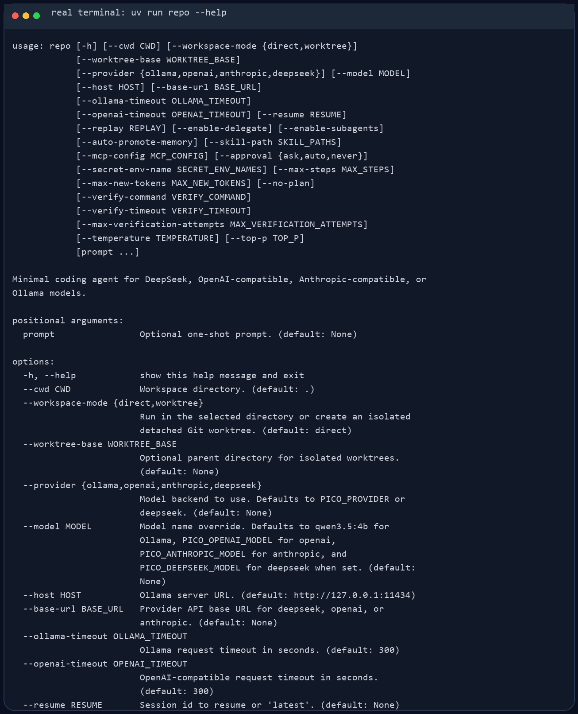
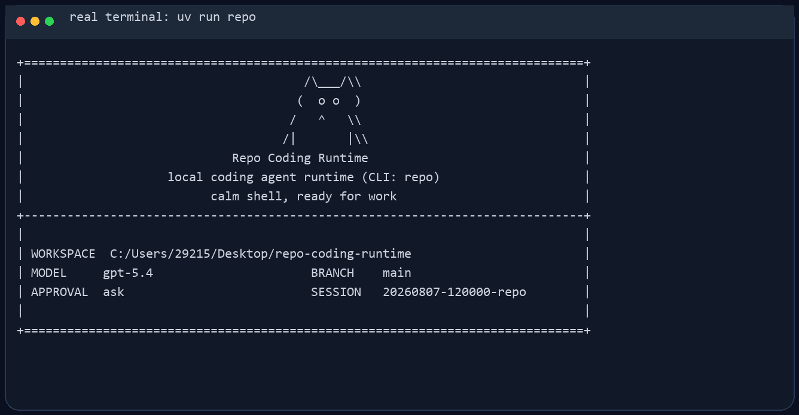
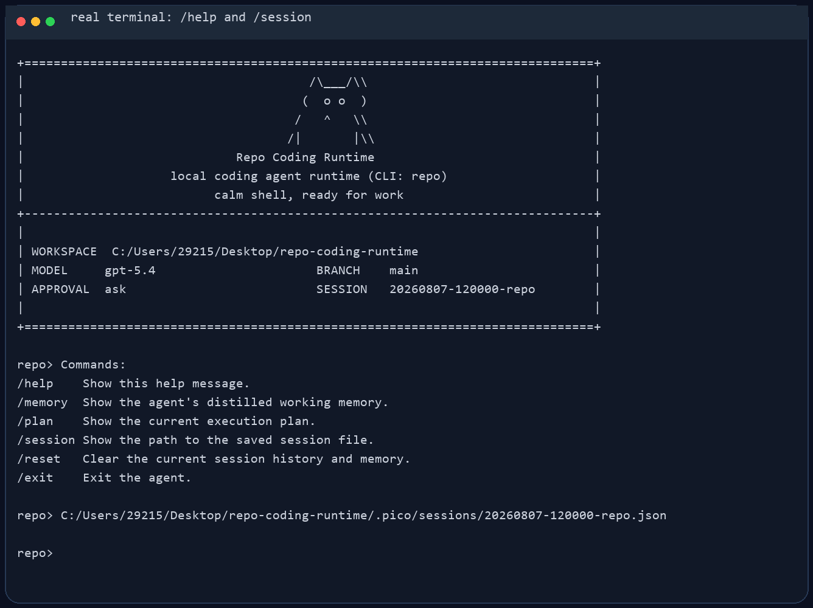

# Repo Coding Runtime

Repo Coding Runtime 是一个面向代码仓库的本地 Coding Agent Runtime。它直接跑在终端里，先看当前工作区，再用一组受约束的工具去读文件、改文件、跑命令，并把会话状态保存在本地 `.pico/` 目录里。公开 CLI 命令是 `repo`；源码包、环境变量和旧版 `pico` 命令继续保留，以兼容现有代码和运行工件。

它更像一个能在仓库里持续工作的命令行 Coding Agent，不是纯聊天窗口。你可以拿它做代码排查、测试修复、仓库分析，或者让它在当前项目里执行一次性的工程任务。

## 适合做什么

- 在本地仓库里排查测试失败
- 读取当前代码结构并给出修改建议
- 基于现有文件做小步迭代，而不是脱离仓库空想
- 在会话中保留上下文，支持继续上一次工作

## 主要特性

- 显式任务状态机：`created → planning → executing/verifying → completed/stopped/failed`
- 统一 Tool Registry + Tool Gateway：内置工具与 MCP 工具共享参数校验、审批、执行、审计和错误映射
- 按需 Skills：从 `SKILL.md` 发现可复用工作流，只向相关请求注入指令，不执行 Skill 中的代码
- MCP stdio 工具接入：外部能力经过命名空间隔离后注册进同一工具网关
- 分层记忆、上下文压缩、checkpoint/resume 与稳定 runtime identity
- 版本化运行事件：保留旧 `event` 字段，同时提供 `event_type`、schema version、run/task/phase 标识
- 可选 Git worktree 隔离；脏工作区不会被自动删除
- 原子保存 session、task state 和 report
- CLI 命令是 `repo`（同时兼容旧命令 `pico`），模块入口是 `python -m pico`
- 会话保存在 `.pico/sessions/`，运行工件保存在 `.pico/runs/<run_id>/`
- 支持四类模型后端：
  - Ollama
  - OpenAI 兼容 Responses API
  - Anthropic 兼容 Messages API
  - DeepSeek Anthropic 兼容 API

## 使用截图

CLI 帮助信息：



启动界面：



REPL 内置命令与会话路径：



## 安装

需要 Python 3.10+。

如果你用 `uv`，直接安装依赖：

```bash
uv sync
```

如果你已经在自己的 Python 环境里工作，也可以直接装成可编辑模式：

```bash
pip install -e .
```

## 快速开始

在当前仓库里启动交互模式。默认 provider 是 DeepSeek：

```bash
uv run repo
```

指定另一个工作目录：

```bash
uv run repo --cwd /path/to/repo
```

直接跑一次性任务：

```bash
uv run repo "inspect the test failures and propose a fix"
```

需要把 Agent 的改动与当前 checkout 隔离时，可以显式启用 detached Git worktree：

```bash
uv run repo --cwd /path/to/repo --workspace-mode worktree
```

该模式不会自动删除包含未提交改动的 worktree。运行目录会显示在启动界面，并写入 `report.json`，由使用者确认改动后再显式处理。

如果当前环境已经安装过包，也可以直接这样启动：

```bash
python -m pico
```

## 模型后端

Repo Coding Runtime 启动时会读取项目根目录的 `.env`。本地真实 key 放在 `.env`，仓库只保留 `.env.example`。配置优先级是：

```text
显式 CLI 参数 > .env 里的 PICO_* 变量 > 旧环境变量 > 代码默认值
```

Provider 选择的具体顺序是：

```text
--provider > PICO_PROVIDER > 代码默认 deepseek
```

不传 `--provider` 且没有 `PICO_PROVIDER` 时默认使用 `deepseek`。这是推荐配置路径：DeepSeek 的 Anthropic-compatible endpoint 比本地 Ollama 更少依赖本机模型环境，也比 OpenAI-compatible/Anthropic-compatible 代理少一层默认 gateway 假设。其他 provider 仍然保留，可以在 `.env` 里写 `PICO_PROVIDER=openai`、`PICO_PROVIDER=anthropic`、`PICO_PROVIDER=ollama`，也可以显式传 `--provider openai`、`--provider anthropic` 或 `--provider ollama`。

`.env` 会在构建 provider client 前加载，并覆盖当前进程里的同名环境变量。模型名和 base URL 可以通过 `--model`、`--base-url` 临时覆盖；API key 只从环境变量读取。

本地第一次配置：

```bash
cp .env.example .env
```

然后把要使用的 provider key 填进去。`.env` 已经被 `.gitignore` 忽略，不要提交真实 key。

### 推荐配置：DeepSeek

最小配置只需要 key：

```bash
PICO_DEEPSEEK_API_KEY="your-api-key"
```

默认模型和接口是：

```bash
PICO_DEEPSEEK_API_BASE="https://api.deepseek.com/anthropic"
PICO_DEEPSEEK_MODEL="deepseek-v4-pro"
```

所以常规情况下 `.env` 里只填 `PICO_DEEPSEEK_API_KEY` 就能直接启动：

```bash
uv run repo
```

如果你需要临时切模型或代理地址，不必改 `.env`，可以直接覆盖：

```bash
uv run repo --model deepseek-v4-pro --base-url https://api.deepseek.com/anthropic
```

DeepSeek 当前走 Anthropic-compatible Messages API，所以 runtime 里复用的是 Anthropic-compatible client；这只影响 HTTP 协议，不影响 CLI 用法。

### 可选配置：right.codes

Repo Coding Runtime 在 right.codes 上有两条可选 provider 路径：

- `--provider openai`：走 OpenAI-compatible `/responses`，默认 base URL 是 `https://www.right.codes/codex/v1`，默认模型是 `gpt-5.4`
- `--provider anthropic`：走 Anthropic-compatible `/messages`，默认 base URL 是 `https://www.right.codes/claude/v1`，默认模型是 `claude-sonnet-4-6`

如果 right.codes 给你的是一把共享 key，推荐只填这一项：

```bash
PICO_RIGHT_CODES_API_KEY="your-right-codes-key"
```

然后按需要选择 provider：

```bash
uv run repo --provider openai
uv run repo --provider anthropic
```

如果你想显式区分两条 provider 的 key，也可以分别配置：

```bash
PICO_OPENAI_API_KEY="your-right-codes-key-for-codex"
PICO_ANTHROPIC_API_KEY="your-right-codes-key-for-claude"
```

不要在 `.env` 里写 `PICO_OPENAI_API_KEY=$PICO_RIGHT_CODES_API_KEY` 这种 shell 展开形式；Repo Coding Runtime 的 `.env` 解析器只读取字面量，不展开变量引用。要么只写 `PICO_RIGHT_CODES_API_KEY`，要么把 key 字符串分别填到 provider-specific 变量里。

如果请求 right.codes 返回 `API Key额度不足`，说明协议和 endpoint 已经打通，但当前 key 没有可用额度；换一把有额度的 key，或到 right.codes 后台处理额度。

当前 provider 环境变量：

| provider | base URL | API key | model |
| --- | --- | --- | --- |
| `deepseek` | `PICO_DEEPSEEK_API_BASE`，回退 `DEEPSEEK_API_BASE`，默认 `https://api.deepseek.com/anthropic` | `PICO_DEEPSEEK_API_KEY`，回退 `DEEPSEEK_API_KEY` | `PICO_DEEPSEEK_MODEL`，回退 `DEEPSEEK_MODEL`，默认 `deepseek-v4-pro` |
| `openai` | `PICO_OPENAI_API_BASE`，回退 `OPENAI_API_BASE`，默认 `https://www.right.codes/codex/v1` | `PICO_OPENAI_API_KEY`，回退 `OPENAI_API_KEY`、`PICO_RIGHT_CODES_API_KEY`、`RIGHT_CODES_API_KEY`、`PICO_ANTHROPIC_API_KEY`、`ANTHROPIC_API_KEY` | `PICO_OPENAI_MODEL`，回退 `OPENAI_MODEL`，默认 `gpt-5.4` |
| `anthropic` | `PICO_ANTHROPIC_API_BASE`，回退 `ANTHROPIC_API_BASE`，默认 `https://www.right.codes/claude/v1` | `PICO_ANTHROPIC_API_KEY`，回退 `ANTHROPIC_API_KEY`、`PICO_RIGHT_CODES_API_KEY`、`RIGHT_CODES_API_KEY`、`PICO_OPENAI_API_KEY`、`OPENAI_API_KEY` | `PICO_ANTHROPIC_MODEL`，回退 `ANTHROPIC_MODEL`，默认 `claude-sonnet-4-6` |
| `ollama` | `--host`，默认 `http://127.0.0.1:11434` | 不需要 | `--model`，默认 `qwen3.5:4b` |

如果有额外的敏感环境变量需要从 trace/report 里脱敏，可以用 `PICO_SECRET_ENV_NAMES` 配置逗号分隔的变量名，或启动时重复传 `--secret-env-name NAME`。

### OpenAI 兼容接口

如果要改用 OpenAI-compatible `/responses` 服务，显式传 `--provider openai`：

```bash
uv run repo --provider openai
```

默认 OpenAI 兼容接口使用 right.codes 的 Codex endpoint：

```bash
PICO_OPENAI_API_BASE="https://www.right.codes/codex/v1"
PICO_RIGHT_CODES_API_KEY="your-right-codes-key"
PICO_OPENAI_MODEL="gpt-5.4"
```

也可以改成其他 OpenAI-compatible 服务：

```bash
PICO_OPENAI_API_BASE="https://your-api.example/v1"
PICO_OPENAI_API_KEY="your-api-key"
PICO_OPENAI_MODEL="gpt-5.4"
```

### Anthropic 兼容接口

如果要改用 Anthropic-compatible 服务，显式传 `--provider anthropic`：

```bash
uv run repo --provider anthropic
```

默认 Anthropic 兼容接口使用 right.codes 的 Claude endpoint：

```bash
PICO_ANTHROPIC_API_BASE="https://www.right.codes/claude/v1"
PICO_RIGHT_CODES_API_KEY="your-right-codes-key"
PICO_ANTHROPIC_MODEL="claude-sonnet-4-6"
```

如果你的服务端对多个兼容接口复用了同一套密钥，Repo Coding Runtime 也支持从 `PICO_ANTHROPIC_API_KEY` 回退到 `ANTHROPIC_API_KEY`、`PICO_RIGHT_CODES_API_KEY`、`RIGHT_CODES_API_KEY`、`PICO_OPENAI_API_KEY` 或 `OPENAI_API_KEY`。

### Ollama

如果要改用本地 Ollama，显式传 `--provider ollama`：

```bash
ollama serve
ollama pull qwen3.5:4b
uv run repo --provider ollama --model qwen3.5:4b
```

## 常用交互命令

- `/help`：查看内置命令
- `/memory`：查看提炼后的工作记忆
- `/session`：查看当前会话文件路径
- `/reset`：清空当前会话状态
- `/exit` 或 `/quit`：退出 REPL

V1 默认不启用实验性的 `delegate` 子 Agent，也不会根据模型最终回答自动写入长期记忆。
如需显式体验这两项能力，可以启动时传入 `--enable-delegate` 或
`--auto-promote-memory`；正常运行建议保持关闭，避免不完整的多 Agent 流程和启发式记忆污染核心会话。

## Skills

Repo Coding Runtime 默认发现当前仓库 `.pico/skills/**/SKILL.md`。Skill 是只读的声明式工作流，不会从 Skill 目录执行 Python 或 shell；其中声明的工具也必须已经存在于 Tool Registry，实际调用仍然经过 Tool Gateway。

示例：

```markdown
---
name: python-bugfix
description: Diagnose and fix Python test failures.
version: 1.0.0
tools: [read_file, patch_file, run_shell]
tags: [python, pytest, debugging]
risk_level: medium
---
Read the failing test and implementation first. Make the smallest patch, then run focused tests.
```

也可以重复传入显式路径；传空列表给 Python API 会关闭默认 Skills 扫描：

```bash
uv run repo --skill-path /path/to/team-skills --skill-path /path/to/project-skills
```

## MCP 工具

Repo Coding Runtime 默认读取仓库内存在的 `.pico/mcp.json`，也可以通过 `--mcp-config` 指定。每个 MCP 工具会映射成 `mcp__<server>__<tool>`，避免与内置工具重名，并复用同一套 schema 校验、风险审批和 trace。

```json
{
  "mcpServers": {
    "project": {
      "command": "python",
      "args": ["-m", "your_mcp_server"],
      "timeout": 20,
      "env": {}
    }
  }
}
```

启动：

```bash
uv run repo --mcp-config .pico/mcp.json
```

MCP Server 不可用时默认记录诊断并跳过该 Provider，不会绕过 Gateway；远端标记为非只读的工具默认按高风险工具处理。

## V1.5：Plan–Execute–Verify

V1.5 在 V1 Runtime 上增加可恢复的串行执行计划和验证闭环：

- `<plan>` 计划会被保存到 Session、Checkpoint 和 Report；计划节点支持 pending/running/completed/blocked/failed 状态。
- 工具执行会推进当前计划节点；多节点计划会在节点完成后继续请求模型处理下一个节点。
- `--verify-command` 可配置测试或校验命令。验证失败时，runtime 会把失败证据写入 Trace，并在限定次数内自动回到 planning 阶段。
- `--replay <trace.jsonl|run_id>` 可回放一次运行的状态变迁、工具调用和验证结果。

示例：

```bash
uv run repo --verify-command "python -m pytest -q" "修复当前测试失败"
uv run repo --replay .pico/runs/<run_id>/trace.jsonl
```

V1.5 仍保持单 Agent、单 ToolGateway 和显式审批边界，不会默认启用多 Agent 委派或自动长期记忆。

## V1.5.1：稳定性、Benchmark 与 Demo

V1.5.1 在 V1.5 的基础上补齐跨平台命令执行、可重复的 Plan–Execute–Verify
Benchmark 和三个 Review Demo：

- Windows 下对常见 `python -c '...'` 校验命令做安全的 argv 归一化，其他命令仍保留原有 Shell 执行语义。
- Benchmark 使用新鲜 fixture 副本、确定性 FakeModelClient、验证命令和可复现元数据，覆盖计划执行、验证失败修复和 Trace/Replay 证据。
- Demo 覆盖 Plan–Verify 成功、安全策略阻断破坏性命令、Replay 运行证据。

从仓库根目录运行：

```bash
python scripts/run_benchmark.py
python scripts/run_v1_5_1_demos.py
```

结果默认写入 `artifacts/v1_5_1/` 和 `artifacts/v1_5_1_demos/`，其中包含
Benchmark JSON/Markdown、`task_state.json`、`trace.jsonl`、`report.json` 和
可读的 `replay.txt`。这些运行工件默认被 Git 忽略。

## V1.6：Repo Index 与可回滚代码修改

V1.6 面向 coding-agent 最常见的两个瓶颈：模型不知道应该先看哪里，以及
修改动作难以审查和恢复。新增能力仍然全部经过同一个 ToolGateway：

- `get_file_outline` 使用 Python AST 输出类、函数、方法、导入和语法诊断；
  `find_symbol`、`find_references` 提供带文件、行号和作用域的导航证据。
- `get_dependency_graph` 对相对导入做仓库内的 best-effort 解析，帮助 Agent
  先建立模块关系再决定要读哪些文件；`get_changed_files` 读取 Git 变更事实。
- `preview_diff` 先展示统一 Diff；`apply_patch` 严格校验文件头、Hunk 行数和
  上下文，所有文件通过预检后才写入，并生成 `.pico/patches/` 下的备份。
- `rollback_patch` 会校验文件当前指纹仍然等于补丁应用后的指纹；如果用户已经
  二次修改，回滚会拒绝覆盖，避免 Agent 抹掉新工作。

典型调用顺序：

```text
get_file_outline → find_symbol/find_references → preview_diff
→ apply_patch → run_shell/verify → rollback_patch（需要时）
```

模型也可以使用结构化调用：

```xml
<tool>{"name":"find_symbol","args":{"name":"ToolGateway","path":"pico"}}</tool>
<tool name="apply_patch"><patch>--- a/pico/example.py
+++ b/pico/example.py
@@ -1,2 +1,2 @@
 ...
</patch></tool>
```

Repo Index 是按文件指纹复用的内存索引，不会把整个仓库预加载到 prompt；
Agent 仍需通过工具按需读取源码。补丁备份属于本地运行状态，默认写入被忽略的
`.pico/` 目录，不作为业务源码提交。

## V2：Supervisor + Task Graph + Read-only Sub-Agents

V2 把 V1 中实验性的 `delegate` 发展为一个有边界的多 Agent Supervisor：

- `TaskGraph` 校验任务 ID、依赖关系和循环，并按依赖就绪顺序调度任务；失败会向下游传播为 `blocked`。
- `run_task_graph` 启动最多 6 个 bounded read-only 子 Agent。子 Agent 只能使用仓库读取、Repo Index 和 Diff 预览工具，不能写文件、执行 shell 或继续派生 Agent。
- 每个子 Agent 有独立的 Session、RunStore 和 `task_graph.json`；父任务 Trace 记录 `subagent_started` / `subagent_finished` 生命周期事件。
- 依赖任务的研究结论会注入后续子任务，Supervisor 最后返回结构化任务状态和 artifacts 位置。
- `--isolate_worktrees` 可在 Git 仓库中为子任务申请 detached worktree；非 Git 环境会安全降级为只读共享工作区并记录原因。

启用 V2：

```bash
python -m pico --v2 "先梳理仓库结构，再分析 runtime 的依赖关系"
```

V2 当前采用确定性的串行调度，主 Agent 仍是唯一负责代码写入的角色；子 Agent 负责任务拆分上的“分工”，但不会未经 Supervisor 审核修改源码。运行工件位于：

```text
.pico/runs/<run_id>/subagents/<graph_id>/
├── task_graph.json
└── <task_id>/
    ├── session/
    └── runs/<child_run_id>/
```

这使得 V2 可以在面试中清楚回答：任务如何拆分、依赖如何保证、子 Agent 如何受限、失败如何传播，以及每个子任务如何复盘。V2 不宣称已经实现分布式并行 Agent、跨机器队列或自动合并子 Agent 代码。

## V2.1–V2.4：结构化证据、恢复控制与 Coding Workflow

这组增强把 V2 从“能编排研究子任务”推进到“可恢复、可审计、能闭环交付”的本地 coding-agent runtime：

- `EvidenceBundle` 统一保存 `summary`、`findings`、`evidence`、`risks`、`recommendations` 和 `confidence`；证据项包含相对文件路径、行号、符号、结论和置信度。Supervisor 会去重聚合，并把已完成依赖的证据以 JSON 注入后续任务。
- 每个 `GraphTask` 有 `attempts`、`max_attempts`、`timeout_seconds` 和 `retry_history`。Supervisor 在子 Agent 异常或超时后按预算重试；`task_graph.json` 是持久化 checkpoint，`resume + graph_id` 会恢复中断的 running task，并阻止依赖失败任务继续消费不完整结论。
- `run_coding_workflow` 固定执行 `research → patch preview → strict unified diff → explicit verification → guarded rollback`。它复用已有 `PatchJournal`，验证失败时只在文件指纹未被二次修改的前提下回滚。

端到端工具调用需要调用方明确提供研究任务、统一 Diff 和验证命令：模型/上层 Supervisor 不会凭空生成或偷偷应用补丁。完整状态写入：

```text
.pico/runs/<run_id>/coding_workflow/<workflow_id>/workflow.json
```

没有父运行时，状态写入 `.pico/workflows/<session_id>/<workflow_id>/workflow.json`。为避免把大段研究结果塞回下一轮 prompt，工具返回有界摘要，完整研究证据、重试历史、验证输出和回滚记录以 artifact 为准。

可重复运行端到端 Demo：

```bash
python scripts/run_v2_4_demos.py
```

Demo 会分别验证成功交付和验证失败自动回滚。当前调度仍是串行的；超时使用 provider 调用的线程预算，不能强制终止一个不响应的第三方进程，因此生产接入仍应选择支持取消/请求超时的模型客户端。

## 安全与持久化

Repo Coding Runtime 不会默认把所有动作都放开。像 shell 执行、文件写入这类高风险操作，会受审批模式控制：

- `--approval ask`
- `--approval auto`
- `--approval never`

实验能力：

- `--enable-delegate`：启用受限的只读 delegate；该能力不属于 V1 默认工具面
- `--auto-promote-memory`：启用用户明确提出记忆请求后的启发式长期记忆写入
- `--no-plan`：关闭 V1.5 计划上下文（不影响 V1 工具执行）
- `--verify-timeout`：限制验证命令的最大执行时间
- `--max-verification-attempts`：限制验证失败后的自动修复轮数

每次运行结束后，都会在 `.pico/runs/<run_id>/` 下写出这些文件：

- `task_state.json`
- `trace.jsonl`
- `report.json`

这些内容默认只保存在本地，不需要跟仓库一起提交。

V1 的关键控制链是：

```text
AgentLoop → ToolGateway → ToolRegistry → built-in / MCP tool
     │            │
     ├─ TaskState ├─ validation / policy / approval / error mapping
     └─ RunEvent  └─ trace.jsonl
```

## 开发

常用本地检查：

```bash
uv run pytest tests -q
uv run ruff check pico tests scripts
```

内部代码现在按较轻的边界拆分：`pico/evaluation/` 放 benchmark 和 metrics，`pico/providers/` 放模型 provider client，`pico/features/` 放可选运行时能力。新代码应直接使用这些包路径；旧的 `pico.evaluator`、`pico.metrics`、`pico.models` 和 `pico.memory` import 不再作为公共入口保留。
